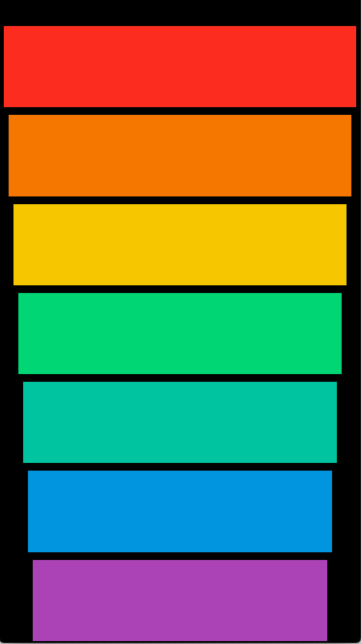

# Xylophone App

iOS app that simulates a Xylophone, playing the notes accordingly to the real instrument.

This app was created through the 8th module of Angela Yu appbrewery's course on Udemy.

# This is the final result

